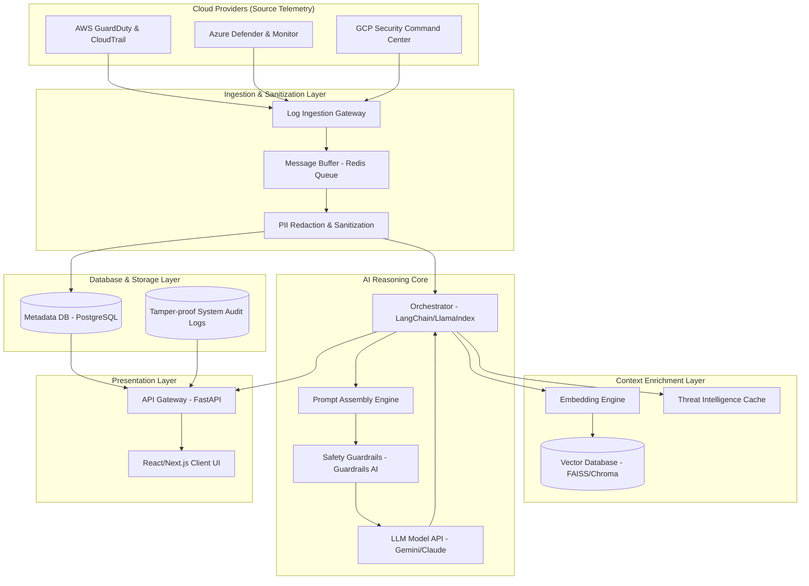

# 07. System Architecture

## Architecture Overview

The **Generative AI-Powered Cloud Security Assistant** is structured as a decoupled, multi-tier microservices architecture. This separation of concerns ensures that the log ingestion layer can scale independently of the AI inference and database operations. The system is divided into five primary functional layers:

1. **Ingestion & Normalization Layer**: Consumes webhook events and streaming JSON payloads from cloud monitoring feeds.
2. **Context Enrichment & Vector Storage Layer (RAG)**: Connects structured security telemetry with real-time threat intelligence and security compliance docs.
3. **AI Core & Guardrails Engine**: Coordinates prompt structure, manages safety guardrails, and executes inference requests with remote LLM endpoints.
4. **Data & Telemetry Storage Layer**: Manages persistent alert history, configuration databases, and vector indexing.
5. **Presentation Layer**: Exposes an interactive React/Next.js dashboard and WebSocket-based conversational system to security administrators.

---

## Architectural Diagram

The diagram below details the structural components and the direction of data flow through the assistant:

---

## Layer Definitions

### 1. Ingestion and Sanitization Layer
* **Log Ingestion Gateway**: Exposes highly available HTTP REST endpoints designed to receive pushed alert payloads from AWS EventBridge, Azure Event Grid, or GCP Cloud Pub/Sub webhooks.
* **Redis Message Queue**: Decouples the ingestion gateway from backend parsing processes, preventing traffic spikes from overwhelming downstream resources.
* **PII Redactor**: Employs deterministic regex rules and Named Entity Recognition (NER) models to locate, extract, and replace private data (e.g., specific user names, IP addresses, credentials) with generalized tokens (e.g., `<REDACTED_IP_1>`).

### 2. Context Enrichment Layer
* **Embedding Engine**: Converts raw textual queries and security documentation into high-dimensional vector representations.
* **Vector Database**: Houses vectorized compliance documentation, CIS standards, vendor manuals, and threat intelligence. Supports rapid semantic lookups matching the context of incoming logs.
* **Threat Intelligence Cache**: Stores cached records of CVE vulnerabilities and exploit indices to enrich context.

### 3. AI Reasoning Core
* **Orchestrator**: The central runtime manager that controls the flow of context, formats prompts, handles LLM responses, and schedules tool invocations.
* **Prompt Assembly Engine**: Injects normalized logs, retrieved vector context, and MITRE guidelines into pre-defined prompt templates.
* **Safety Guardrails**: Analyzes proposed model responses to ensure they do not contain toxic language, invalid CLI syntaxes, or security leaks prior to rendering on screen.

### 4. Database and Storage Layer
* **Metadata Database**: Stores parsed alerts, system configurations, user metrics, and past chat histories.
* **Audit Database Collection**: Write-once-read-many (WORM) storage tracking user activities and AI outcomes for compliance auditing.

### 5. Presentation Layer
* **API Gateway (FastAPI)**: Serves as the routing mechanism for WebSockets and JSON REST queries from the frontend.
* **React/Next.js Client UI**: Provides security administrators with real-time dashboards, alerts visualization, interactive threat analysis, and automated markdown reports.
