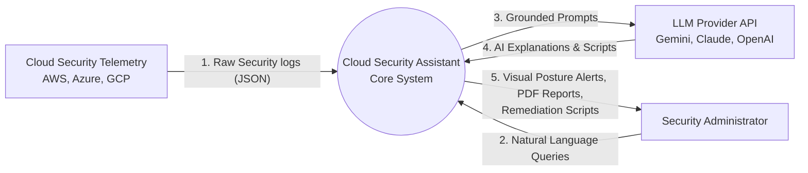
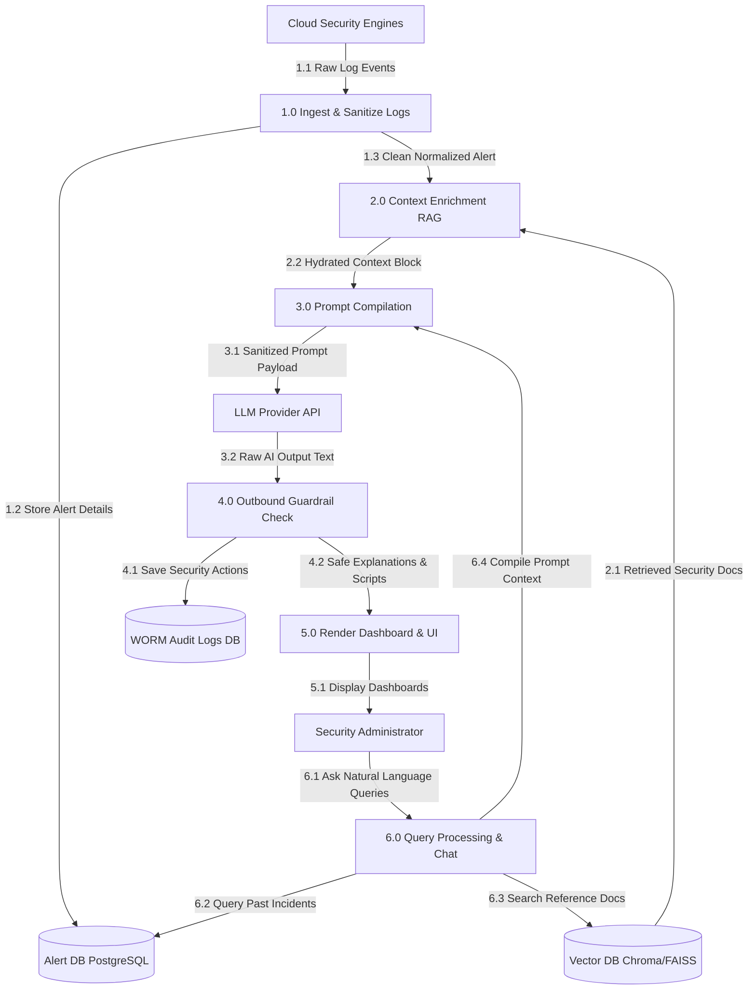

# 15. Data Flow Diagrams

## Introduction

Data Flow Diagrams (DFDs) trace the lifecycle of information within the **Generative AI-Powered Cloud Security Assistant**. They detail how raw cloud alerts and user queries enter the system, how data is processed and sanitized, and how final reports and recommendations are generated and stored.

---

## DFD Level 0: System Context Diagram

The Level 0 context diagram represents the high-level boundary of the assistant, showing communications with external systems and administrators:

---

## DFD Level 1: Subsystem Process Diagram

The Level 1 diagram breaks down the internal components of the assistant, illustrating processes, databases, and structural flows:

---

## DFD Element Definitions

### 1. External Entities
* **Cloud Security Engines**: AWS GuardDuty/CloudTrail, Azure Defender, and GCP Security Command Center. They generate the raw JSON telemetry feeds that drive the assistant.
* **Security Administrator**: The primary system user. They review alerts, copy remediation code blocks, generate post-incident reports, and run security queries.
* **LLM Provider API**: External AI engines (e.g., Google Gemini, Anthropic Claude) that perform semantic translation, analysis, and script generation.

### 2. Internal Processes
* **1.0 Ingest & Sanitize Logs**: Parses incoming payloads, removes private PII details, standardizes attributes, and schedules processing queues.
* **2.0 Context Enrichment (RAG)**: Formulates vector search queries matching the alert parameters, retrieves security controls from the vector index, and gathers threat context.
* **3.0 Prompt Compilation**: Integrates user questions, system instructions, normalized logs, and grounding contexts into unified prompts.
* **4.0 Outbound Guardrail Check**: Analyzes LLM outputs against security blocklists and syntax linters before final release.
* **5.0 Render Dashboard & UI**: Broadcasts processed alert structures and chat interactions to the React web portal.
* **6.0 Query Processing & Chat**: Manages user session conversations and retrieves historical details from database collections.

### 3. Data Stores
* **Alert DB (PostgreSQL)**: Relational database storing normalized incident histories, user accounts, and system configuration data.
* **Vector DB (Chroma/FAISS)**: Vector index containing security documentation, compliance controls, and threat intelligence.
* **WORM Audit Logs DB**: A read-only audit log database containing system access logs, LLM outputs, and user activity records.
