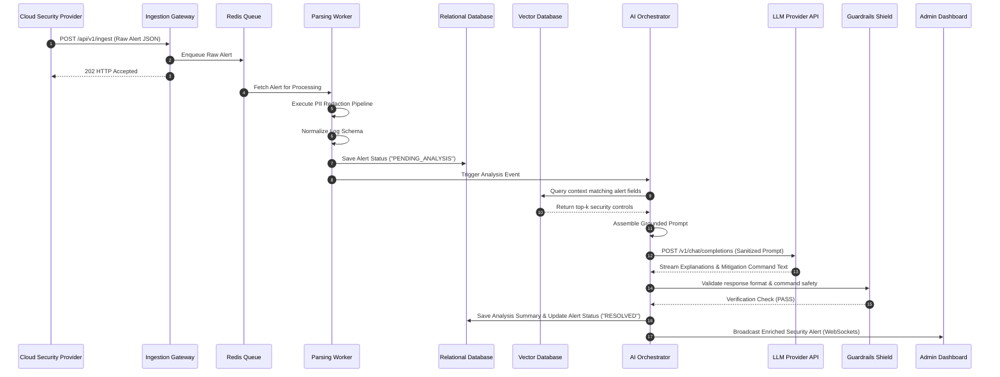
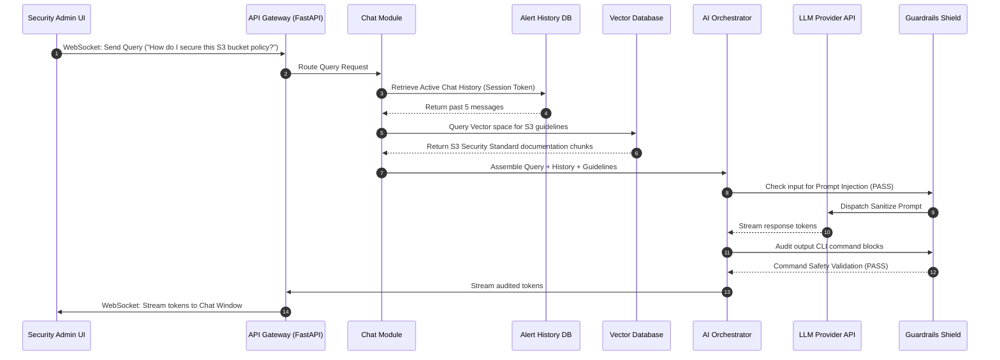
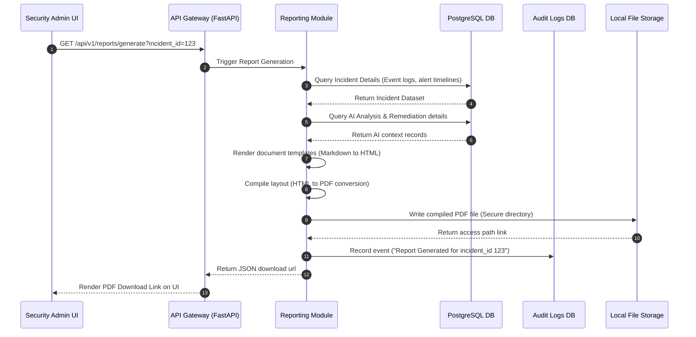

# 16. Sequence Diagrams

## Introduction

Sequence diagrams illustrate the chronological flow of messages, processing steps, and API calls across different system layers. Below are detailed workflows for alert triaging, conversational queries, and PDF report creation.

---

## 1. Log Ingestion & Threat Analysis Sequence

This sequence traces the path of a security log from detection to user dashboard notification:

---

## 2. Interactive conversational Query Sequence

This sequence details how a security administrator queries the system for follow-up details:

---

## 3. Incident Report Generation Sequence

This sequence details the compilation and download workflow for incident summaries:

