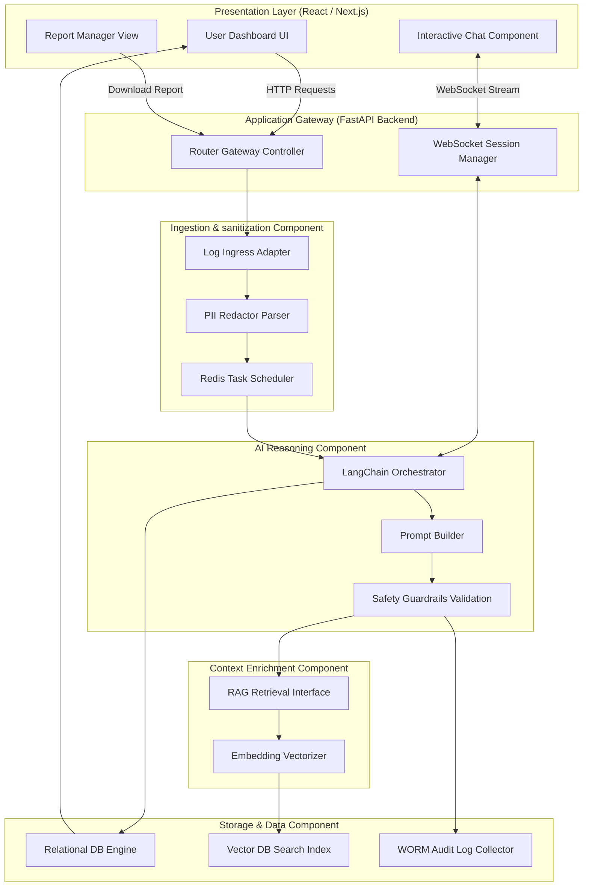

# 17. Component Diagrams

## Introduction

The component diagram describes the logical division of the **Generative AI-Powered Cloud Security Assistant** into reusable components, mapping their boundaries, exposed interfaces, and execution paths.

---

## System Component Diagram

The following diagram groups the system into distinct operational containers:

---

## Component Specifications

### 1. Presentation Layer Component
* **User Dashboard UI**: Renders real-time security alerts, vulnerability severity charts, and multi-cloud posture logs.
* **Interactive Chat Component**: Provides a conversational UI for asking questions, displaying real-time streamed responses, and formatting CLI scripts.
* **Report Manager View**: Allows admins to trigger compilation tasks, view timelines, and download post-mortem documents.

### 2. Application Gateway Component
* **Router Gateway Controller**: Exposes HTTP endpoints (`/api/v1/auth`, `/api/v1/alerts`, `/api/v1/reports`), validating authentication tokens and routing actions.
* **WebSocket Session Manager**: Maintains active, full-duplex WebSocket connections for streaming responses from the AI orchestrator to active chat consoles.

### 3. Ingestion & Sanitization Component
* **Log Ingress Adapter**: Accepts webhook logs from AWS GuardDuty, Azure Defender, and GCP Security Command Center.
* **PII Redactor Parser**: Normalizes input payloads and strips access keys, private email accounts, and specific host IP addresses.
* **Redis Task Scheduler**: Handles system scaling by enqueueing sanitized log entries for async processing.

### 4. AI Reasoning Component
* **LangChain Orchestrator**: Coordinates workflow state, formats alerts context, and communicates with LLM APIs.
* **Prompt Builder**: Assembles structured templates, combining active alert information with retrieved knowledge base files.
* **Safety Guardrails Validation**: Scans generated outputs to prevent execution leaks, SQL injection commands, or toxic content.

### 5. Context Enrichment Component
* **Embedding Vectorizer**: Converts plain-text strings into 1536-dimensional vector arrays.
* **RAG Retrieval Interface**: Runs cosine similarity searches across the vector database indexes, filtering results by cloud vendor and service type metadata.

### 6. Storage & Data Component
* **Relational DB Engine**: Manages Postgres databases containing normalized log collections, dashboard configurations, and user credentials.
* **Vector DB Search Index**: ChromaDB or Pinecone databases storing embedded security guidelines.
* **WORM Audit Log Collector**: Logs all system events to a secure database configured to block trace modifications.
