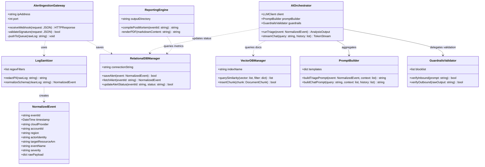

# 18. Class Diagrams

## Introduction

The UML class diagram describes the static structure of the **Generative AI-Powered Cloud Security Assistant**. It details classes, database interfaces, helper modules, attributes, methods, and relationships.

---

## System Class Diagram

The diagram below details the core classes and their operational dependencies:

---

## Class Definitions & Methods

### 1. `AlertIngestionGateway`
* **Attributes**:
  * `ipAddress`, `port`: Network configurations.
* **Methods**:
  * `receiveWebhook()`: Gateway entry point for POST events.
  * `validateSignature()`: Ensures incoming logs originate from verified cloud webhook channels.
  * `pushToQueue()`: Serializes and offloads logs to the Redis queue.

### 2. `LogSanitizer`
* **Attributes**:
  * `regexFilters`: Patterns matching secret keys, access tokens, email formats, and public IP networks.
* **Methods**:
  * `redactPII()`: Replaces sensitive indicators with generalized tokens.
  * `normalizeSchema()`: Maps parsed values into the unified `NormalizedEvent` format.

### 3. `AIOrchestrator`
* **Attributes**:
  * `client`: Concrete wrapper representing model APIs (Gemini, Claude).
  * `promptBuilder`: Reference to prompt construction module.
  * `guardrails`: Instance of safety verification shield.
* **Methods**:
  * `runTriage()`: Executes threat analysis pipelines for newly ingested events.
  * `streamChat()`: Formulates query prompts and streams generated text back to browser portals.

### 4. `GuardrailsValidator`
* **Attributes**:
  * `blocklist`: Prohibited terminal utilities and wildcard permission operations.
* **Methods**:
  * `verifyInbound()`: Scans prompts for adversarial override payloads.
  * `verifyOutbound()`: Scans LLM responses to ensure recommended scripts are syntactically valid and secure.

### 5. `ReportingEngine`
* **Attributes**:
  * `outputDirectory`: Storage path for compiled PDF reports.
* **Methods**:
  * `compilePostMortem()`: Builds a markdown incident report by joining alert histories and AI analyses.
  * `renderPDF()`: Converts compiled markdown files into page-numbered PDF documents.
