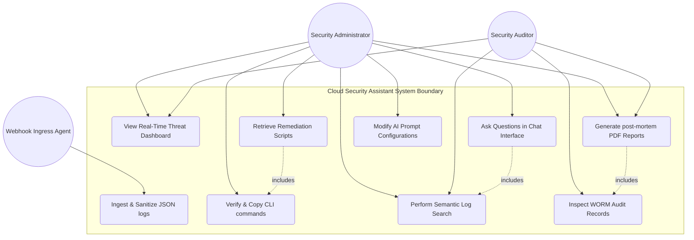

# 19. Use Case Diagrams

## Introduction

The Use Case diagram identifies the boundaries of the **Generative AI-Powered Cloud Security Assistant**, mapping interactions between system actors (Security Administrator, Auditor, and Webhook Agent) and the core features of the application.

---

## System Use Case Diagram

The diagram below details the operational boundaries and associated use cases:

---

## Actor Definitions

### 1. Security Administrator
* **Role**: Primary operator responsible for resolving threats, managing configuration, and maintaining cloud posture.
* **Interactions**:
  * Monitors dashboards to detect active incidents.
  * Conversations with the AI to refine remediation actions.
  * Reviews and copy-pastes CLI scripts to mitigate security risks.
  * Customizes prompting logic to align analysis outputs with company policies.

### 2. Security Auditor
* **Role**: Compliance assessor responsible for verifying posture standards and reviewing security records.
* **Interactions**:
  * Evaluates historical logs using semantic search queries.
  * Generates PDF compliance summaries for external audits.
  * Audits system access history and AI outcomes to verify integrity.

### 3. Webhook Ingress Agent (System Actor)
* **Role**: Automated worker representing external event brokers (e.g., AWS EventBridge, Azure Event Grid).
* **Interactions**:
  * Pushes security events and alert payloads to Ingestion endpoints.
  * Triggers threat interpretation queues.
