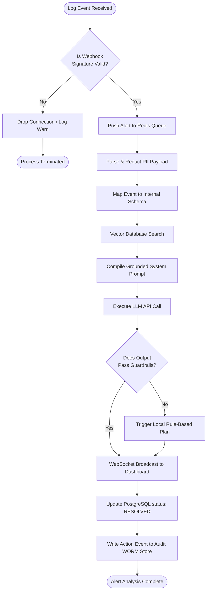
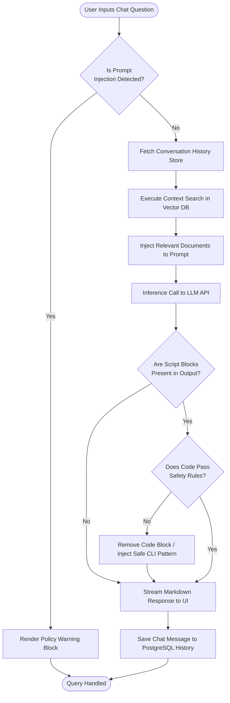

# 20. Activity Diagrams

## Introduction

Activity diagrams depict the procedural workflow and decision pathways within the **Generative AI-Powered Cloud Security Assistant**. They highlight routing choices, security validations, and fallback states.

---

## 1. Automated Log Triaging & Analysis Flow

This diagram details the sequence of checks and processing tasks executed upon log ingestion:

---

## 2. Interactive conversational Query Flow

This workflow illustrates how the assistant processes user questions about security events:

