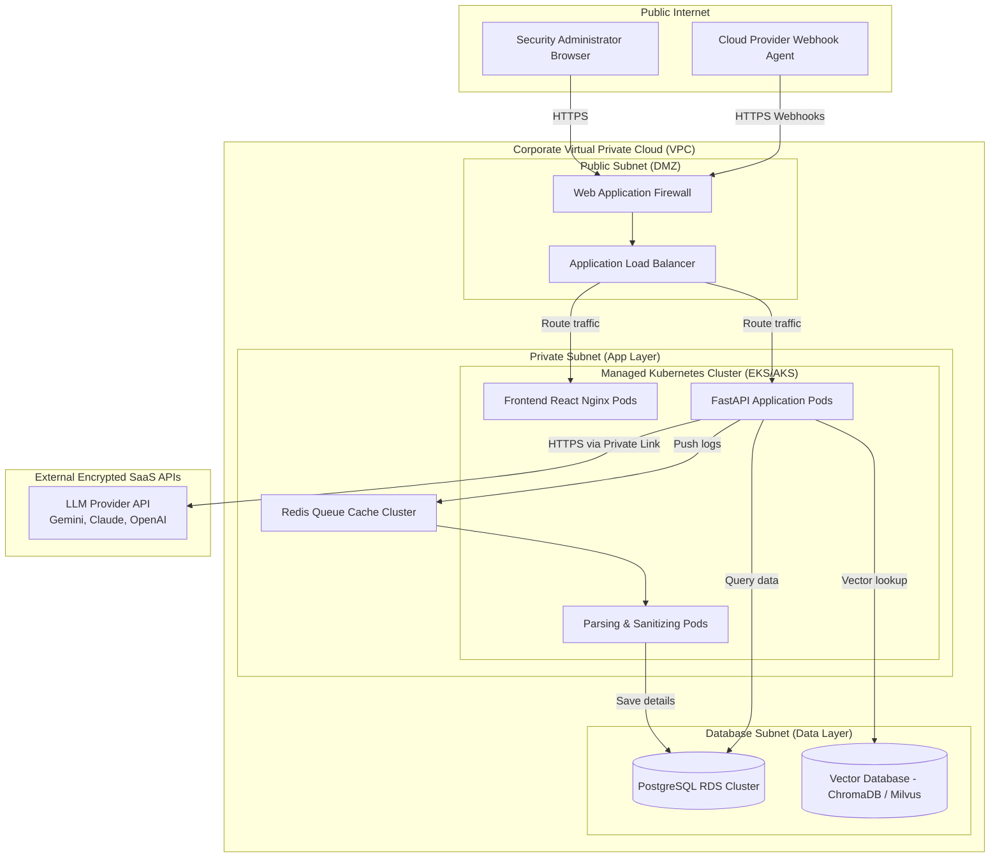

# 21. Deployment Architecture

## Introduction

The deployment architecture of the **Generative AI-Powered Cloud Security Assistant** is containerized, secure, and designed to scale within isolated virtual networks. The deployment blueprint describes hosting the application inside a managed Kubernetes cluster (e.g., AWS EKS, Azure AKS, or GCP GKE) with strict network segmentation.

---

## Deployment Network Diagram

The following topology outlines the division of resources across network boundaries:

---

## Subnet Architecture & Isolation

To minimize the blast radius of any application vulnerability, network access is segregated using Virtual Private Cloud (VPC) subnets and Security Groups:

### 1. Public Subnet (DMZ)
* **Components**: Web Application Firewall (WAF) and Application Load Balancer (ALB).
* **Security Constraints**: Only allows inbound traffic on port 443 (HTTPS) from authorized enterprise IP ranges or designated webhook API endpoints. All HTTP (port 80) traffic is automatically redirected to HTTPS.

### 2. Private Subnet (App Layer)
* **Components**: Managed Kubernetes Nodes running Pod configurations (Frontend Nginx nodes, FastAPI backend servers, and queue workers) and the Redis caching server.
* **Security Constraints**: Has no direct inbound routing from the internet. All incoming connections must route through the ALB. Outgoing internet access is routed via NAT Gateways for API calls.

### 3. Database Subnet (Data Layer)
* **Components**: PostgreSQL database clusters and Vector database instances.
* **Security Constraints**: Isolated. Allows inbound connections only on port 5432 (PostgreSQL) and the designated Vector DB port (e.g., 8000 for ChromaDB) originating exclusively from IP addresses in the Private App Subnet. Direct internet routing is entirely blocked.

---

## Multi-Cloud Integrations & API Connections

* **Log Source Pipelines**: Integrations use cloud-native message relays (AWS EventBridge, Azure Event Grid, GCP Cloud Pub/Sub) to push events to the public Ingestion Gateway.
* **Private API Gateways**: Outgoing calls to LLM APIs (Gemini/Claude) route through secure network tunnels (e.g., AWS PrivateLink) where supported, keeping telemetry traffic off the public internet.
