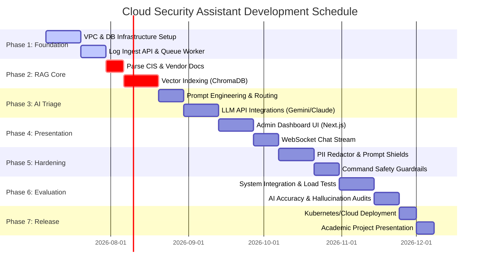

# 26. Development Roadmap

## Roadmap Overview

The development roadmap maps out a 18-week timeline for building and delivering the **Generative AI-Powered Cloud Security Assistant**. The timeline is structured into seven sequential phases, moving from database and API foundation setup to AI integration, security hardening, and deployment.

---

## Project Gantt Chart

The schedule below details the phases and task tracks:

---

## Detailed Phase Breakdown

### Phase 1: Environment Setup & Log Ingest (Weeks 1-3)
* **Goal**: Establish the network foundation, database configurations, and log-ingestion APIs.
* **Key Tasks**:
  * Set up local development environments and configure target cloud accounts.
  * Establish the PostgreSQL metadata database schema.
  * Build the REST log-ingestion endpoint (`POST /api/v1/ingest`) and hook it up to a Redis message queue buffer.
* **Deliverable**: A functional API that ingests cloud alert JSON payloads, queue buffers them, and saves normalized records to the relational database.

### Phase 2: RAG Pipeline & Vector Indexing (Weeks 4-6)
* **Goal**: Build the knowledge retrieval system containing CIS benchmarks and cloud security manuals.
* **Key Tasks**:
  * Parse PDF and Markdown security manuals into structured database records.
  * Configure ChromaDB vector index schemas.
  * Create semantic query functions to retrieve top-k document chunks based on alert attributes.
* **Deliverable**: An operational vector index database capable of retrieving relevant compliance rules based on security keywords.

### Phase 3: AI Reasoning & LLM Triage (Weeks 7-9)
* **Goal**: Core threat analysis reasoning logic.
* **Key Tasks**:
  * Write and test prompt templates for varying incident categories.
  * Implement the tiered LLM routing module (routing low-severity alerts to Gemini Flash, critical threats to Claude).
  * Build downstream parsers to split natural language explanations from remediation command blocks.
* **Deliverable**: An AI service layer that accepts normalized alerts, queries the vector database for context, and outputs detailed threat explanations and remediation scripts.

### Phase 4: Frontend Development & WebSockets (Weeks 10-12)
* **Goal**: Build the administrative console UI.
* **Key Tasks**:
  * Scaffold the Next.js frontend, applying dark-mode dashboards and alerts tables.
  * Establish bidirectional WebSocket connections between the browser and backend to support real-time token streaming.
  * Implement copy-to-clipboard elements for recommended remediation shell commands.
* **Deliverable**: An interactive browser-based portal displaying live security alerts and containing a functional conversational chat window.

### Phase 5: Security Guardrails & Hardening (Weeks 13-14)
* **Goal**: Establish system safety firewalls.
* **Key Tasks**:
  * Write the regular expression processing rules to scrub PII and credentials from raw logs before LLM transmission.
  * Configure inbound prompt injection filters (Prompt Shields).
  * Build outbound parsers to identify and block unsafe commands (e.g., wildcard security policy adjustments).
* **Deliverable**: Input/output security filters that intercept prompts and responses to ensure data privacy and command safety.

### Phase 6: Integration Testing & AI Evaluation (Weeks 15-16)
* **Goal**: System optimization, performance verification, and output evaluation.
* **Key Tasks**:
  * Run automated unit and integration tests across the ingestion pipeline.
  * Execute latency and load tests to verify system stability under traffic spikes.
  * Run target validation datasets through the LLM to verify retrieval accuracy and check for hallucinations.
* **Deliverable**: System test documentation confirming the application meets latency, accuracy, and security standards.

### Phase 7: Deployment & Presentation (Weeks 17-18)
* **Goal**: Project release and final presentation preparations.
* **Key Tasks**:
  * Compile the system into Docker containers and deploy the stack to Kubernetes.
  * Package all system documentation for final review.
  * Run simulated incident demos to prepare for the academic evaluation panel.
* **Deliverable**: A live cloud deployment of the assistant, accompanied by a final project overview video and presentation guides.
